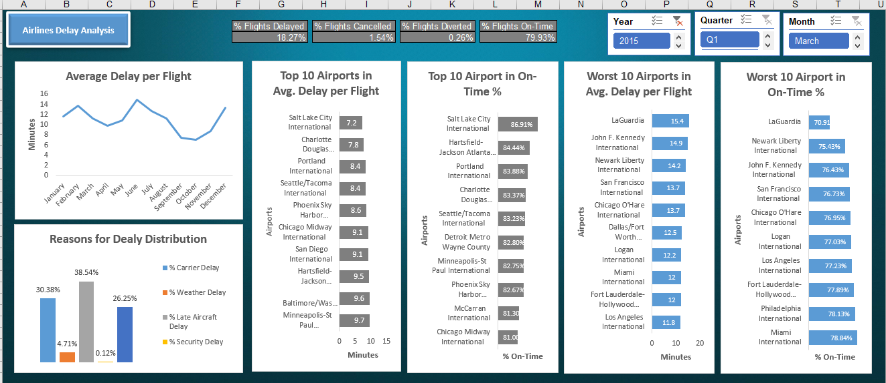
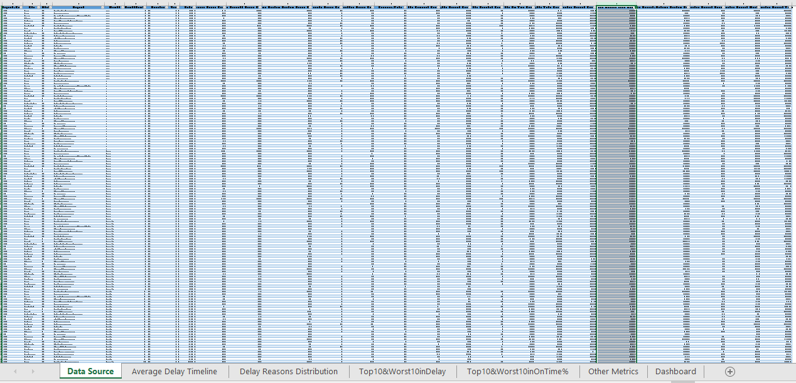
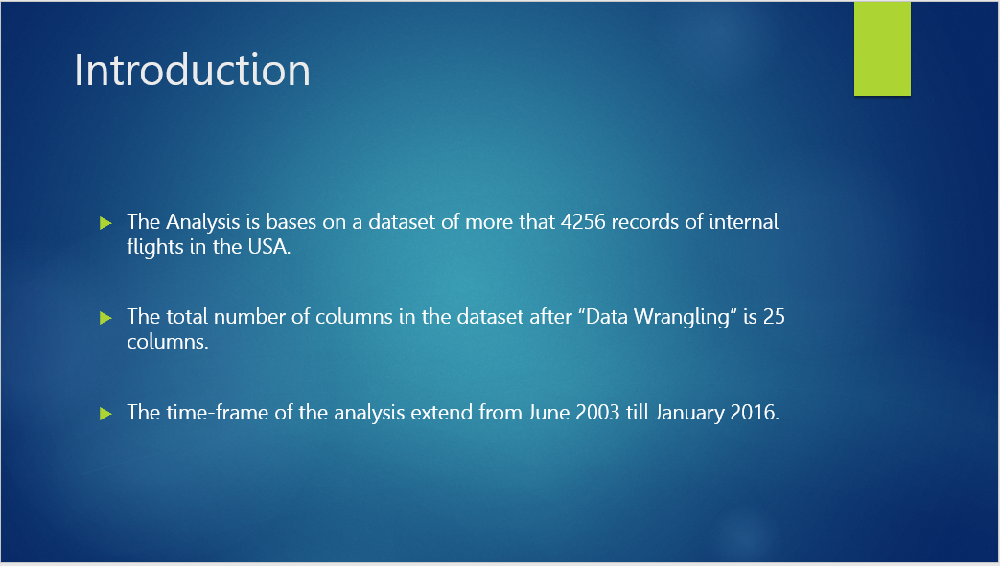
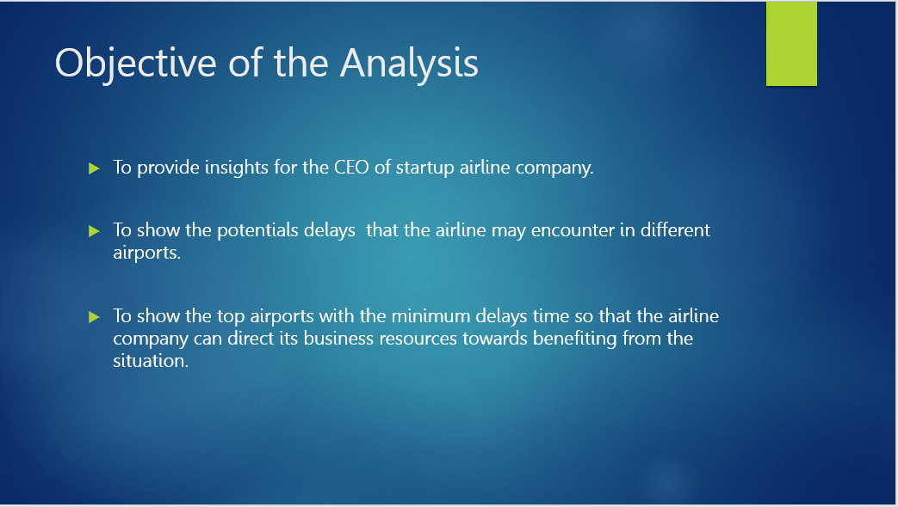
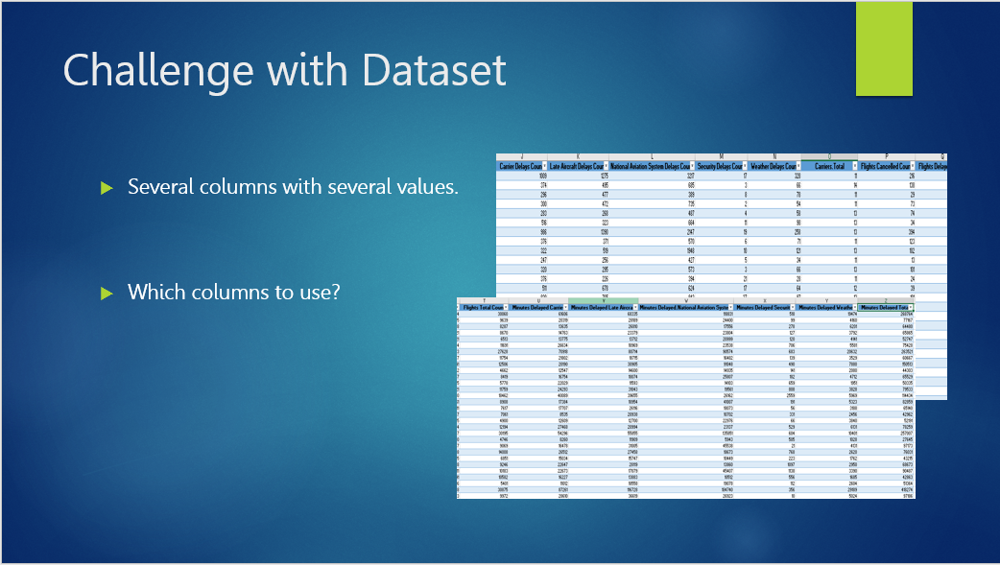
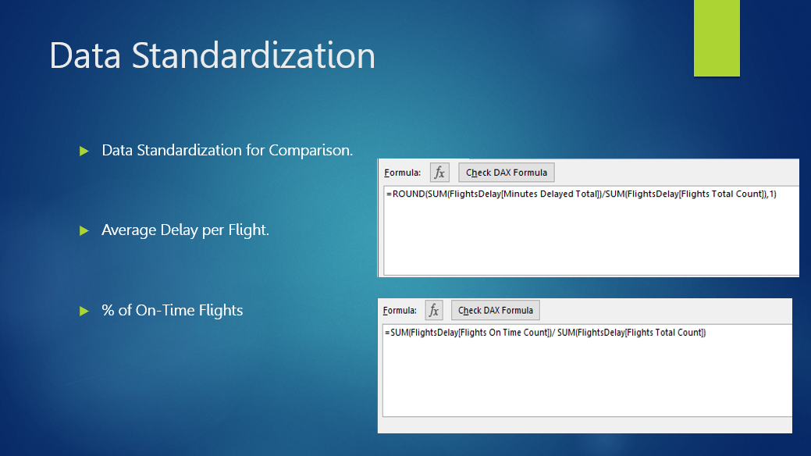
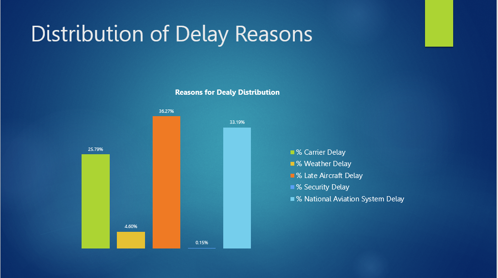
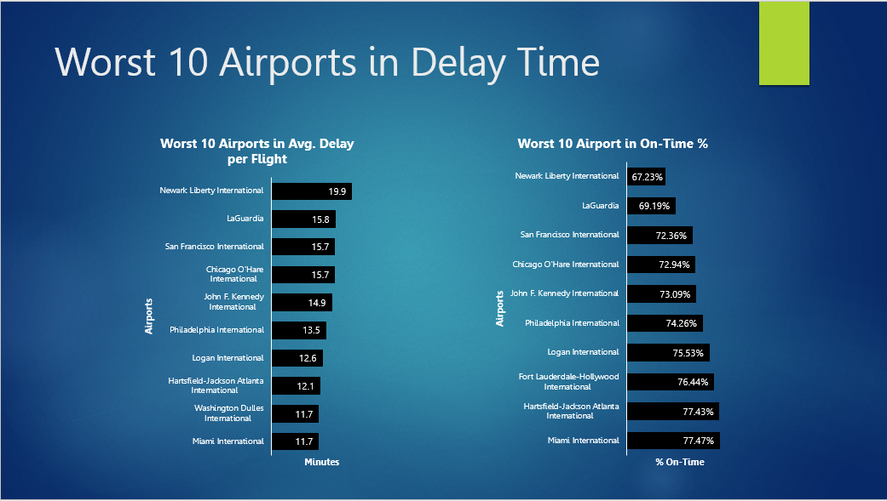
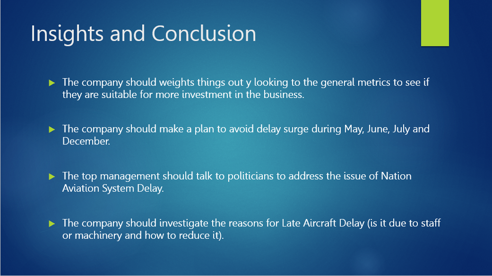

# Flights Delay in USA Airports Analysis

## Introduction:
The aim of this project was to __provide insights and hints for the CEO of startup airline by showing the potential delays the new airline may encounter in different airports__.
The objective of this project was to __build self-service dynamic and interactive dashboard that shows the performance of airport in term of the metrics of managing flight delays__.

### Dataset
This analysis project is based on a dataset that is contained inside one of the sheet in the Excel file of the project. This dataset includes more than 4200 records of internal flight flights in the USA. The total number of columns is 26 and the time-frame of the data extends from June 2003 till January 2016.

### Business Metrics
To evaluate the performance of the airports in term of flight delay management, I calculated the following metrics:
- Average Delay per Flight (in minutes).
- Percentage of Flights on Time.
- Percentage of Flights Delayed.
- Percentage of Flights Diverted.
- Percentage of Flights Cancelled.

## Project Tasks Sumamry
In this project I:
\
1- Cleaned and transformed the data.
\
2- Built pivot-tables.
\
3- Used DAX formulas to calculate business metrics.
\
4- Constructed a self-service dynamic and interactive dashboard to show the delay management metrics. The visuals of the dashboard included __line chart__, __summary cards__, __column chart__, and __bar charts__.
\
5- Suggested recommendation for the CEO to decrease the risk of the delays.

