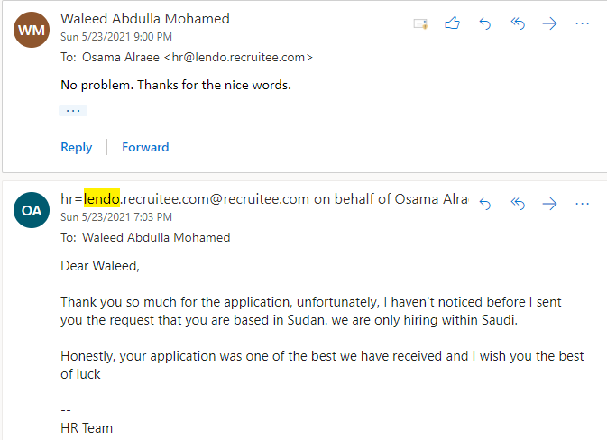

# Lendo  Assessment Test

Months ago, I had applied for one of the largest startup companies in the Gulf. Next, I received an email from them with a test instructions to prove my skills as a data analyst. The test consisted of 3 parts and this project is the third part of that test.

For this project, I was provided with Excel file containing containing multiple sheets and 8 instructions to transform data with those sheets. 
The question of this project stated that only 4 instructions were mandatory, while the rest were optional. I solved/excuted ALL of them. To achieve that,
I used a combination of functions and techneques such as such as sumifs, countifs, vlookups, , index, match, data validation, conditional formatting, grouping and pivot-tables. 

)

